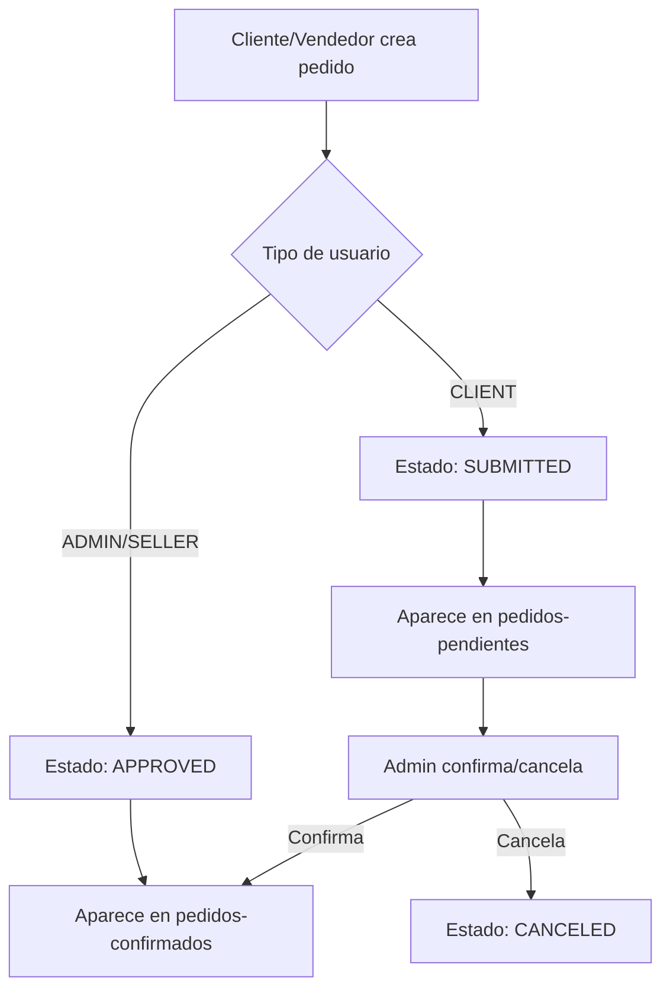

# 🏢 Elecsion Web - Guía Completa para Claude

> **Plataforma e-commerce B2B para distribución de productos eléctricos**
> Desarrollado con Next.js 15, TypeScript, Prisma y PostgreSQL

---

## 📋 Información del Proyecto

### **Descripción General**
Elecsion es una plataforma e-commerce B2B especializada en la venta de productos eléctricos. El objetivo principal es **digitalizar** el proceso de ventas que tradicionalmente se hacía de forma presencial, permitiendo que los clientes conozcan todo el catálogo y generen pedidos autónomamente, sin necesidad de que un vendedor esté presente.

### **Modelo de Negocio**
- **Situación actual**: Vendedores visitan clientes físicamente para crear pedidos
- **Objetivo**: Clientes autónomos que naveguen catálogo y generen pedidos independientemente
- **Proceso post-aprobación**: Los pedidos se exportan a otra plataforma (fuera del alcance)
- **Facturación/Envío**: Se maneja externamente, esta plataforma solo gestiona pedidos/cotizaciones

### **Stack Tecnológico**
- **Frontend**: Next.js 15 con TypeScript y Turbopack
- **Styling**: Tailwind CSS
- **Base de Datos**: PostgreSQL (migrado desde SQLite)
- **ORM**: Prisma
- **Autenticación**: NextAuth.js
- **Estado Global**: Zustand (para carrito)
- **Deployment**: Vercel
- **Imágenes**: Sistema basado en SKU local

---

## 🗄️ Arquitectura de Base de Datos

### **Modelos Principales**
```prisma
// Usuario con roles diferenciados
User {
  id: String (cuid)
  name: String
  email: String (único)
  role: UserRole (ADMIN, SELLER, CLIENT)
  assignedSellerId: String? // Para clientes asignados a vendedores
}

// Marcas de productos
Brand {
  id: String (cuid)
  name: String
  slug: String (único)
  isActive: Boolean
}

// Productos del catálogo
Product {
  id: String (cuid)
  sku: String (único)
  name: String
  priceBase: Decimal
  currency: String (USD/ARS)
  stockQty: Int?
  isActive: Boolean
  isDeleted: Boolean
  isFeatured: Boolean
  brandId: String
}

// Pedidos y cotizaciones
Order {
  id: String (cuid)
  code: String (COT-X / ORD-X)
  type: OrderType (QUOTE, ORDER)
  status: OrderStatus (SUBMITTED, APPROVED, CANCELED)
  clientUserId: String
  total: Decimal
}

// Contadores para IDs secuenciales
Counter {
  name: String (único)
  value: Int
}
```

### **Relaciones Clave**
- **User ↔ Order**: Un cliente puede tener múltiples pedidos
- **Brand ↔ Product**: Una marca tiene múltiples productos
- **Product ↔ OrderItem**: Productos se incluyen en pedidos via items
- **User (vendedor) ↔ User (cliente)**: Relación de asignación

---

## 🏗️ Estructura de Directorios

```
src/
├── app/                          # App Router (Next.js 15)
│   ├── api/                      # API Routes
│   │   ├── auth/                 # NextAuth endpoints
│   │   ├── brands/               # CRUD marcas
│   │   ├── products/             # CRUD productos + búsqueda
│   │   ├── orders/               # CRUD pedidos/cotizaciones
│   │   ├── clients/              # Gestión clientes
│   │   └── exchange-rate/        # Cotización USD→ARS
│   ├── catalogo/                 # Catálogo público
│   ├── pedido-rapido/            # Herramienta vendedores
│   ├── mi-cuenta/                # Dashboard usuarios
│   └── pedidos-pendientes/       # Gestión pedidos admin
├── components/                   # Componentes reutilizables
│   ├── catalog/                  # Componentes del catálogo
│   ├── pedido-rapido/            # Componentes pedido rápido
│   └── ui/                       # Componentes base (Toast, Modal)
├── lib/                          # Utilidades y configuración
│   ├── db.ts                     # Cliente Prisma
│   ├── session.ts                # Gestión sesiones
│   ├── email.ts                  # Templates de email
│   ├── counter.ts                # Generación IDs secuenciales
│   └── utils/                    # Utilidades específicas
└── store/                        # Estado global (Zustand)
    └── cart.ts                   # Estado del carrito
```

---

## 🔄 Flujos de Trabajo Principales

### **1. Gestión de Productos**
1. **Importación**: Excel → `/api/productos/import` → Prisma
2. **Imágenes**: Upload directo a `/public/product-images/` por SKU
3. **Activación**: Solo productos `isActive: true` aparecen en catálogo

### **2. Proceso de Pedidos**


### **3. Cotización de Monedas**
- **Productos USD**: Productos importados (precios en dólares, cobro en pesos)
- **API Externa**: `/api/exchange-rate` → https://dolarapi.com (BNA)
- **Conversión**: Precio USD × Cotización BNA = Precio ARS mostrado
- **Carrito**: Productos USD se guardan convertidos a ARS
- **Sin vencimiento**: Las cotizaciones no tienen fecha de expiración por ahora

### **4. Sistema de IDs Secuenciales**
- **Cotizaciones**: COT-1, COT-2, COT-3...
- **Pedidos**: ORD-1, ORD-2, ORD-3...
- **Implementación**: Tabla `Counter` con transacciones atómicas

---

## 🔐 Roles y Permisos

### **ADMIN**
- ✅ Acceso completo a gestión de productos
- ✅ Ver/gestionar todos los pedidos
- ✅ Subir imágenes de productos
- ✅ Crear pedidos que van directamente a APPROVED

### **SELLER**
- ✅ Usar pedido rápido para crear pedidos presenciales
- ✅ Ver **solo** pedidos de clientes asignados (no de otros vendedores)
- ✅ Crear pedidos que van directamente a APPROVED
- ❌ No puede gestionar productos

### **CLIENT**
- ✅ Navegar catálogo completo (objetivo: autonomía total)
- ✅ Crear cotizaciones/pedidos independientemente (van a SUBMITTED)
- ✅ Ver historial propio
- ✅ Un cliente = un vendedor asignado (relación 1:1)
- ❌ No accede a gestión

### **VISITANTE (Sin sesión)**
- ✅ Navegar catálogo completo
- ✅ Crear cotizaciones SIN precios mostrados
- ❌ No puede ver precios ni crear pedidos

---

## 🎨 Componentes Clave

### **ProductImage.tsx**
```typescript
// Manejo inteligente de imágenes con fallbacks
PNG → JPG → placeholder.png
// Skeleton loader durante carga
```

### **ProductCardRow.tsx** (Catálogo)
```typescript
// Cotización USD→ARS automática
// Loader "Obteniendo cotización..."
// Precios duales: USD + ARS
```

### **ProductSearchTable.tsx** (Pedido Rápido)
```typescript
// Vista responsive: tabla + cards
// Conversión automática USD→ARS en carrito
// Estados de carga para cotización
```

### **Toast.tsx + useToast.ts**
```typescript
// Sistema de notificaciones horizontales
// 4 tipos: success, error, warning, info
// Reemplaza alerts del navegador
```

### **ConfirmModal.tsx**
```typescript
// Modal personalizado para confirmaciones
// Reemplaza confirm() del navegador
```

---

## 📊 Información Crítica del Negocio

### **Volumen de Operación**
- **Usuarios**: ~8 vendedores/administradores + 100+ clientes
- **Volumen**: ~1,000 pedidos/mes (~33 pedidos/día)
- **Disponibilidad**: **CRÍTICA** - 24/7 (fuente de ventas principal)
- **Crecimiento**: No planeado múltiples países/monedas a corto plazo

### **Gestión de Usuarios**
- **Clientes nuevos**: Creados manualmente por administradores
- **Sin aprobación de crédito**: Proceso simplificado
- **Asignación vendedor**: Relación 1:1 (un cliente = un vendedor)
- **Segmentación**: Vendedores ven SOLO sus clientes asignados

### **Flujo de Negocio**
1. **Actual**: Vendedor visita cliente → crea pedido presencial
2. **Objetivo**: Cliente navega catálogo → crea pedido autónomo
3. **Post-aprobación**: Export a sistema externo (fuera de alcance)
4. **No gestiona**: Inventario, facturación, envío (sistemas externos)

### **Proveedores y Marcas**
- **Múltiples proveedores**: Gestionados como "marcas" en el sistema
- **Productos importados**: USD (convertidos a ARS al momento de compra)
- **Productos nacionales**: ARS directo

---

## 🔧 APIs Importantes

### **Productos**
- `GET /api/products` - Lista productos con filtros
- `GET /api/products/search` - Búsqueda con texto
- **Filtros**: brand (UUID/slug), isActive, isDeleted

### **Marcas**
- `GET /api/brands` - Solo marcas activas con productos activos
- **Lógica**: `isActive: true` + `products.some({isActive: true})`

### **Pedidos**
- `POST /api/orders` - Crear pedido/cotización
- `PATCH /api/orders/[id]/confirm` - Aprobar pedido
- `PATCH /api/orders/[id]/cancel` - Cancelar pedido

### **Cotización**
- `GET /api/exchange-rate` - Cotización USD→ARS actual
- **Cache**: 15 minutos automático

---

## 📧 Sistema de Emails

### **Templates Disponibles**
1. **quoteCreatedForClient** - Notifica cliente de nueva cotización
2. **quoteCreatedForSellers** - Notifica vendedores de nueva cotización
3. **orderApproved** - Confirma aprobación de pedido
4. **orderCanceled** - Notifica cancelación

### **Configuración**
```typescript
// SMTP configurado via variables de entorno
SMTP_HOST, SMTP_PORT, SMTP_USER, SMTP_PASSWORD, FROM_EMAIL
```

---

## 🛠️ Comandos Útiles

### **Base de Datos**
```bash
# Generar cliente Prisma
DATABASE_URL="postgresql://..." npx prisma generate

# Aplicar migraciones
DATABASE_URL="postgresql://..." npx prisma migrate dev

# Reset base de datos
DATABASE_URL="postgresql://..." npx prisma db push --accept-data-loss
```

### **Desarrollo**
```bash
npm run dev          # Servidor desarrollo (Turbopack)
npm run build        # Build producción
npm run lint         # ESLint
npm run typecheck    # TypeScript check
```

---

## 🐛 Problemas Comunes y Soluciones

### **Error: Campo `isFeatured` no encontrado**
```bash
# Regenerar cliente Prisma
npx prisma generate
```

### **Filtros de marca no funcionan**
- **Causa**: Regex UUID no detecta cuid (25 chars sin guiones)
- **Solución**: Usar `/^[a-z0-9]{25}$/` para detectar cuid

### **Precios USD no se convierten en carrito**
- **Causa**: `addToCart` usa precio original USD
- **Solución**: Convertir precio con `exchangeRate.sell` antes de guardar

### **Imágenes no cargan**
- **Verificar**: Archivo existe en `/public/product-images/[sku].png|jpg`
- **Formato**: SKU sanitizado (solo alfanuméricos y guiones)

---

## 📱 Responsividad

### **Breakpoints Principales**
- **Mobile**: < 768px (md)
- **Tablet**: 768px - 1024px
- **Desktop**: > 1024px (lg)

### **Componentes Adaptativos**
- **ProductSearchTable**: Tabla ↔ Cards
- **Navegación**: Hamburger en móvil
- **Carrito**: Sidebar ↔ Modal

---

## 🔄 Flujos de Git

### **Branches Principales**
- **main**: Producción estable
- **develop**: Desarrollo activo
- **feature/[nombre]**: Features específicos

### **Workflow Recomendado**
1. Crear branch desde `develop`
2. Desarrollar feature
3. Commit con mensaje descriptivo + "🤖 Generated with Claude Code"
4. Push y merge request a `develop`
5. Deploy desde `main`

---

## 🎯 Próximas Mejoras Sugeridas

### **Funcionalidades de Alto Impacto**
- [ ] **Segmentación por vendedor**: Filtros automáticos de clientes asignados
- [ ] **Favoritos/Wishlist**: Para mejorar experiencia cliente autónomo
- [ ] **Histórico de precios**: Tracking de cambios en cotización USD
- [ ] **Sistema de descuentos**: Por volumen o cliente específico
- [ ] **Categorías de productos**: Navegación más intuitiva del catálogo

### **Optimizaciones Técnicas (Considerando 1,000 pedidos/mes)**
- [ ] **Cache Redis**: Para cotizaciones BNA (reducir API calls)
- [ ] **CDN para imágenes**: Mejora velocidad de carga del catálogo
- [ ] **DB Connection pooling**: Para manejar picos de tráfico
- [ ] **Monitoring avanzado**: Disponibilidad 24/7 crítica
- [ ] **Tests automatizados**: Prevenir regresiones en funcionalidad crítica

### **Funcionalidades Futuras (Largo Plazo)**
- [ ] **API de integración**: Para export automático a sistema externo
- [ ] **App móvil**: Para vendedores en visitas presenciales
- [ ] **Dashboard avanzado**: Métricas de ventas por vendedor/cliente
- [ ] **Notificaciones push**: Nuevos productos, cambios de precio

---

## 📞 Contacto y Soporte

### **Variables de Entorno Críticas**
```env
DATABASE_URL=postgresql://...
NEXTAUTH_SECRET=...
SMTP_HOST=...
NEXT_PUBLIC_BASE_URL=...
```

### **URLs de Producción**
- **App**: https://elecsion-web.vercel.app
- **Admin**: /mi-cuenta
- **Catálogo**: /catalogo
- **Pedido Rápido**: /pedido-rapido

---

*Documentación actualizada: Octubre 2024*
*Versión: 1.0*
*Última sesión: Implementación cotización USD→ARS + filtros marca activa*